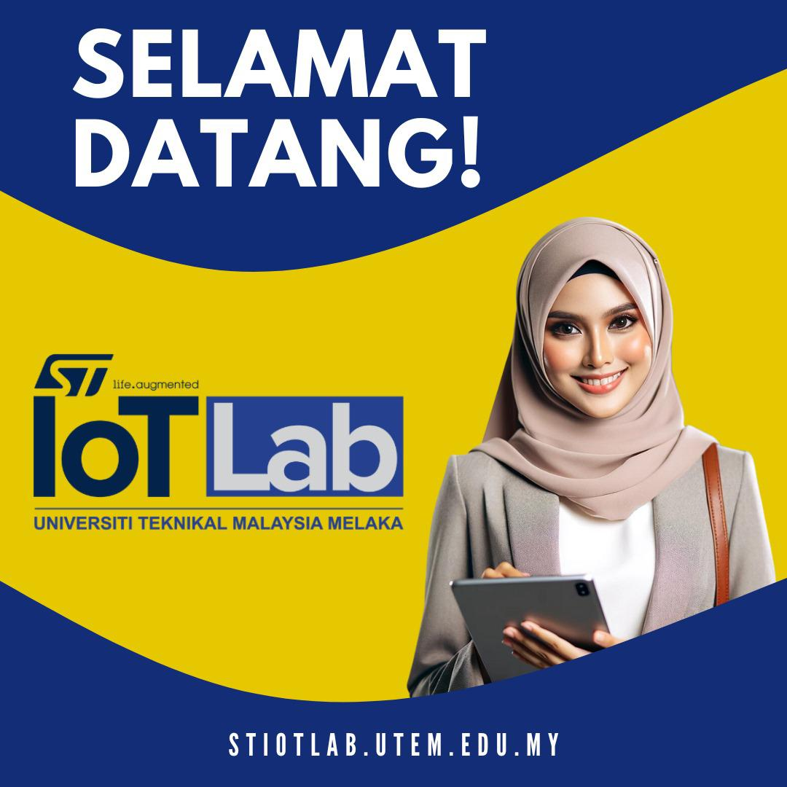
- [1. Welcome](#1-welcome)
- [2. Required Components](#2-required-components)
  - [2.1. Hardware](#21-hardware)
  - [2.2. Software](#22-software)
- [3. Overall Circuit Assembly](#3-overall-circuit-assembly)
  - [3.1. Basic power line wiring](#31-basic-power-line-wiring)
  - [3.2. IR sensor](#32-ir-sensor)
  - [3.3. Buzzer](#33-buzzer)
  - [3.4. Ultrasonic Sensor](#34-ultrasonic-sensor)
  - [3.5. LCD display](#35-lcd-display)
  - [3.6. ESP-01 with adapter](#36-esp-01-with-adapter)
- [4. Arduino IDE Setup](#4-arduino-ide-setup)
  - [4.1. Arduino Version 2.0](#41-arduino-version-20)
    - [4.1.1. Preference Configurations](#411-preference-configurations)
    - [4.1.2. Board Manager Setup](#412-board-manager-setup)
    - [4.1.3. Library Setup](#413-library-setup)
    - [4.1.4. Load the Arduino sketch for WiFi and Blynk Test](#414-load-the-arduino-sketch-for-wifi-and-blynk-test)
    - [4.1.5. Integrate the sensor codes to Load the Arduino sketch](#415-integrate-the-sensor-codes-to-load-the-arduino-sketch)
- [5. Blynk IoT Platform Setup](#5-blynk-iot-platform-setup)
  - [5.1. Log in/Register Account](#51-log-inregister-account)
  - [5.2. Create New Template](#52-create-new-template)
  - [5.3. Add datastream](#53-add-datastream)
  - [5.4. Add Dashboard](#54-add-dashboard)
  - [5.5. Add New Device](#55-add-new-device)
  - [5.6. Copy credentials](#56-copy-credentials)
- [6. Running the project](#6-running-the-project)

# 1. Welcome
This is a github page for Program Pentauliahan Profesional dalam IoT dan Peranti Papan Pemuka Sesi 2025. This page provides every stages of development process in completing the IoT system.

# 2. Required Components
## 2.1. Hardware
1. Nucleo-L432KC
2. ESP-01 (ESP8266) + Adapter Module
3. IR sensor
4. Buzzer
5. Ultrasonic sensor
6. 16x2 LCD display
7. 100 ohm resistor
8. Breadboard (400)
9. Jumper wires (Male-to-Female and Male-to-Male)
10. Micro-USB cable

## 2.2. Software
1. Arduino IDE (2.0+)
2. Blynk IoT Apps (access from web browser)

# 3. Overall Circuit Assembly
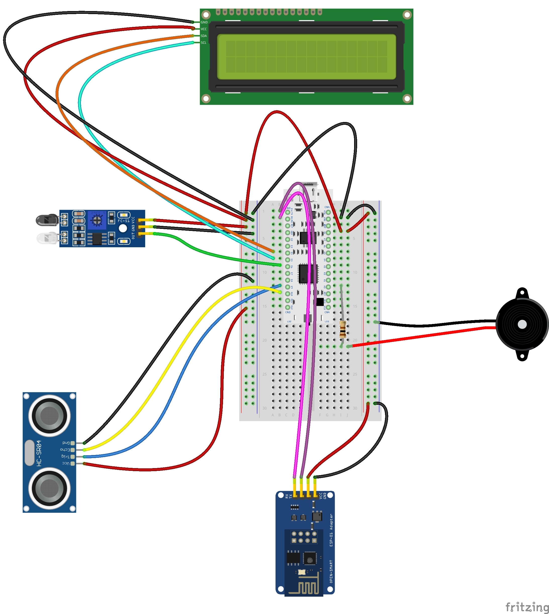

## 3.1. Basic power line wiring
The schematic desribe the connection for power line references regarding Vcc and GND.

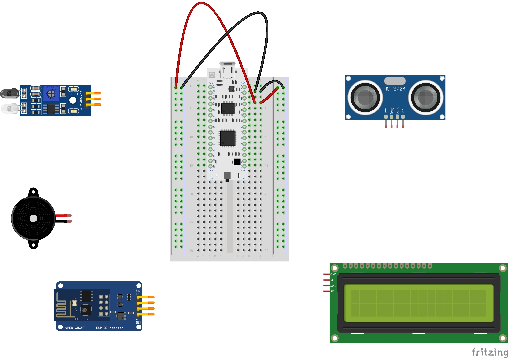

## 3.2. IR sensor
An Infrared (IR) sensor for Arduino is a compact electronic module used to detect objects, motion, or proximity by emitting and receiving infrared light.

|Sensor|Pin|Nucloe-L432KC|
|:-----|:----:|----:|
|IR Sensor|Vcc|Vcc|
||Gnd|Gnd|
||OUT|D6|

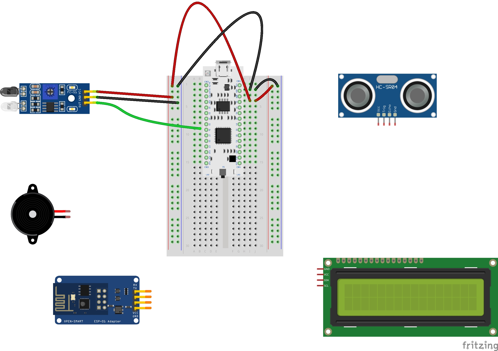

## 3.3. Buzzer
A buzzer is a small sound-producing device used with Arduino to generate tones, alerts, or melodies.

|Device|Pin|Nucloe-L432KC|
|:-----|:----:|----:|
|Buzzer|Gnd|Gnd|
||Vcc|(100 ohm)|
||100 ohm|A0|

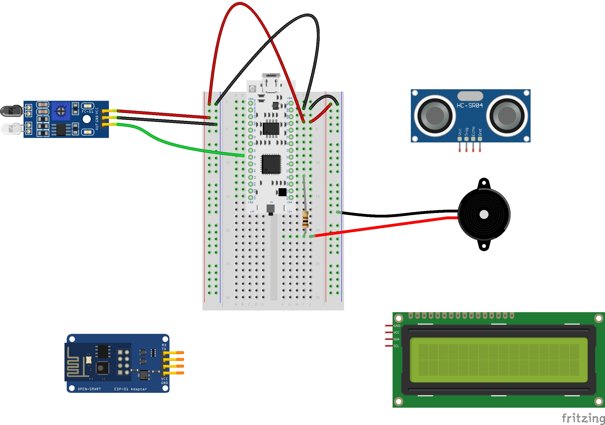

## 3.4. Ultrasonic Sensor
An ultrasonic sensor (like the popular HC-SR04) measures distance by using high-frequency sound waves. It’s a go-to module for obstacle detection and proximity sensing in robotics and automation projects.


|Sensor|Pin|Nucloe-L432KC|
|:-----|:----:|----:|
|Ultrasonic Sensor|Vcc|5V|
||Gnd|Gnd|
||Trig|D9|
||Echo|D10|

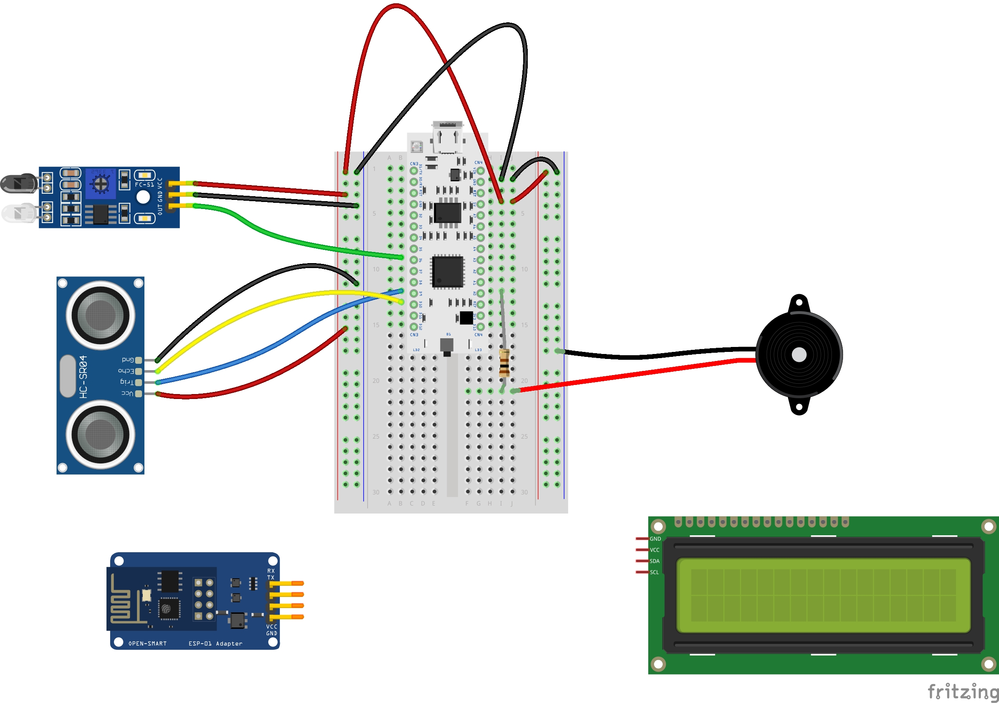

## 3.5. LCD display
A 16x2 LCD is a character display module that shows 2 lines of 16 characters each. It’s widely used in Arduino projects to present text, sensor data, or system status.

|Device|Pin|Nucloe-L432KC|
|:-----|:----:|----:|
|LCD|Vcc|5V|
||Gnd|Gnd|
||SDA|D4|
||SCL|D5|

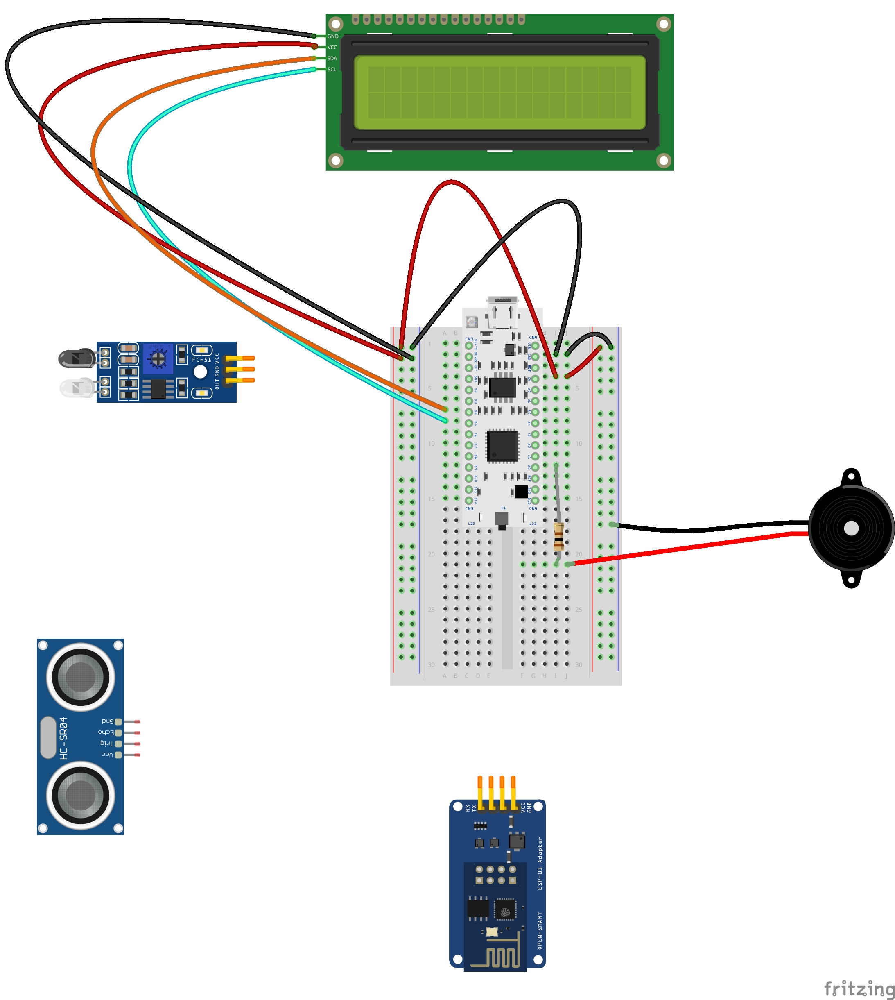
>Download and open the [LCD sketch](./stiot2022-v2/LCD.ino) for testing.

## 3.6. ESP-01 with adapter
The ESP-01 is functions to enable wifi connection to the Nucleo-L432KC. The adapter simplified the connection from 8-pin to 4-pin wiring. 
|Sensor|Pin|Nucloe-L432KC|
|:-----|:----:|----:|
|ESP-01|Vcc|5V|
||Gnd|Gnd|
||Tx|D0|
||Rx|D1|


# 4. Arduino IDE Setup
## 4.1. Arduino Version 2.0
###  4.1.1. Preference Configurations

1. Navigate to **File > Preferences**
   
   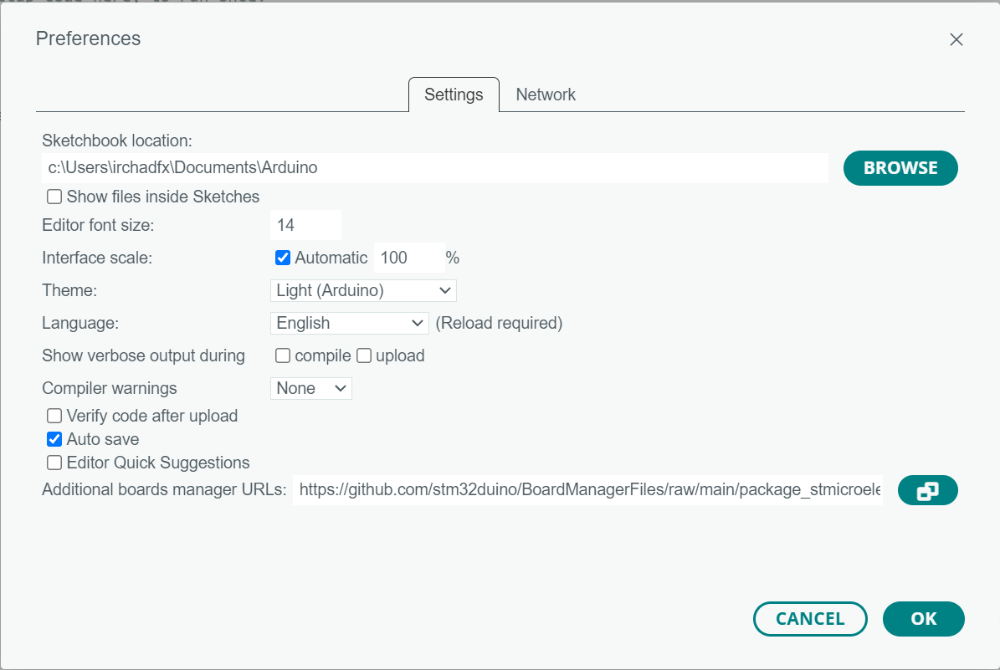

2. Click on the icon for **Additional Boards Manager URLs**

    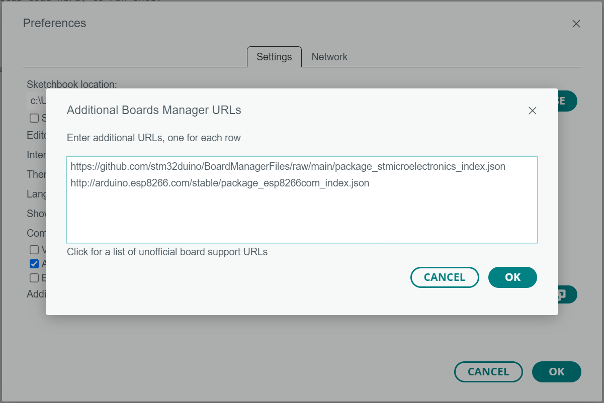  

3. Type the following links into the textbox.
   
   ```
   https://github.com/stm32duino/BoardManagerFiles/raw/main/package_stmicroelectronics_index.json
   http://arduino.esp8266.com/stable/package_esp8266com_index.json
   ```

4. Press **OK**

###  4.1.2. Board Manager Setup

1.  Navigate to **Tools > Board: > Board Manager**
   
    
  
2.  Type ```stm32``` in the search box. Select "STM32 MCU based Boards" and click **Install**.
    
    
  
3. Type ```esp8266``` in the search box. Select "esp8266" and click **Install**.

    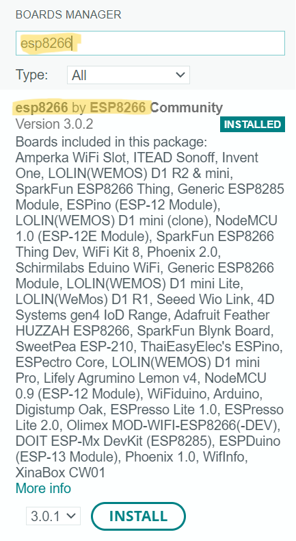

###  4.1.3. Library Setup

1. Navigate to **Sketch > Include library > Manage Libraries**

2. In the search box, type ```liquidcrystal_i2c```. Click **Install**

    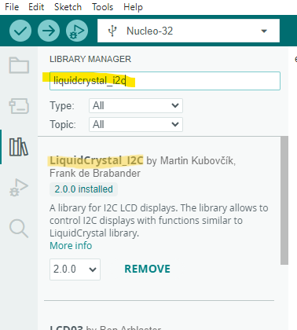

3. In the search box, type ```blynk```. Click **Install**

    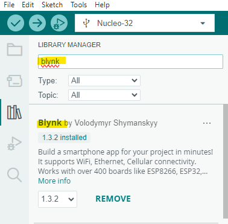

###  4.1.4. Load the Arduino sketch for WiFi and Blynk Test

> Test your ESP8266 Wifi connection and Blynk app first by running this sketch. [Blynk-ESP sketch](./stiot2022-v2/blynkesp.ino)

###  4.1.5. Integrate the sensor codes to Load the Arduino sketch
Download and open the [sensor sketch](./stiot2022-v2/LCD_all.ino) in your PC.

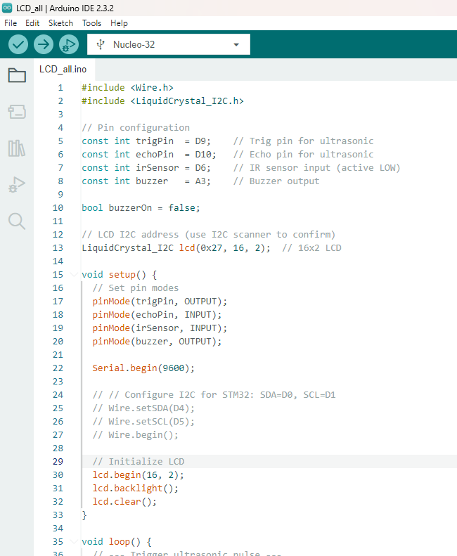


# 5. Blynk IoT Platform Setup

Navigate to [Blynk Cloud](https://sgp1.blynk.cloud/dashboard/login) in your browser.

## 5.1. Log in/Register Account
Do log in to your account or register a new account if you don't have any.


The main interface of blynk.cloud

## 5.2. Create New Template
1. Click on the **Developer Zones > My Templates**.
   
    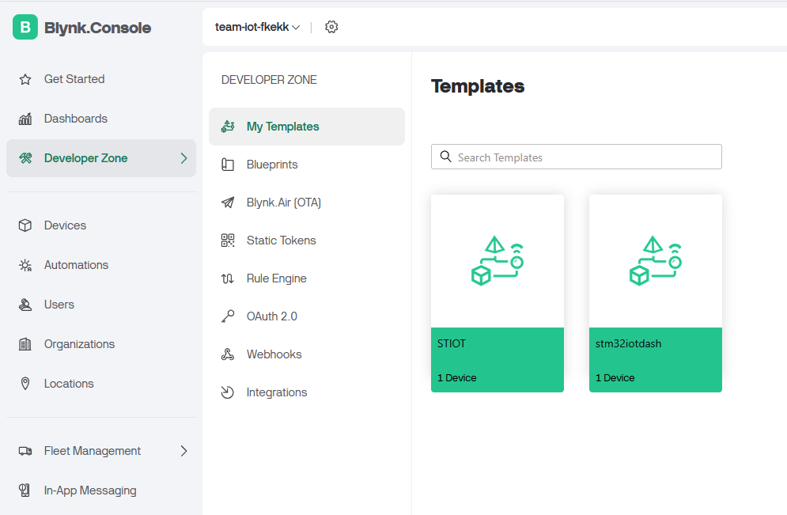

2. Click the "+ New Template" to create new template

    

3. Fill in the details for your new template. Click **Done** when finished.
   
   

4. The interface for your template as follows.
   
    

## 5.3. Add datastream
Datastream indicated the type and value of data that will be received by Blynk Cloud from your STM32 board.

1. From the template page, click on the **Datastream** tab. Then click the **Edit** button on the right side.
   
   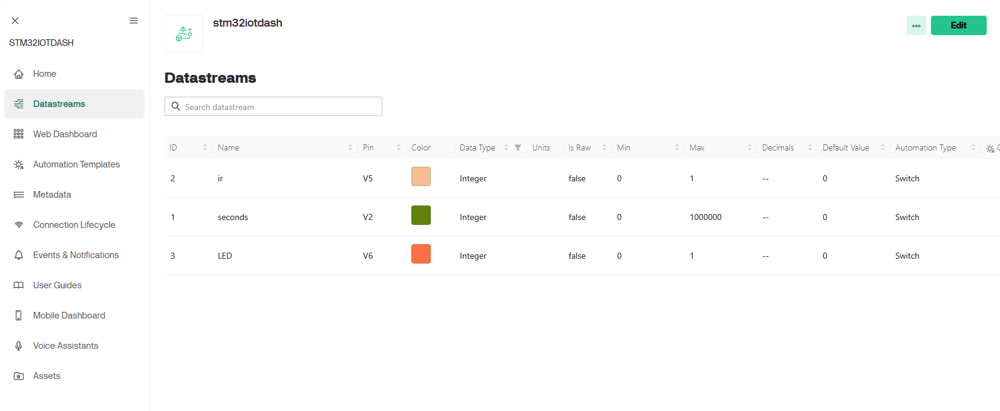

2. Click on the **+ New Datastream** and select **Virtual Pin**.  
   
    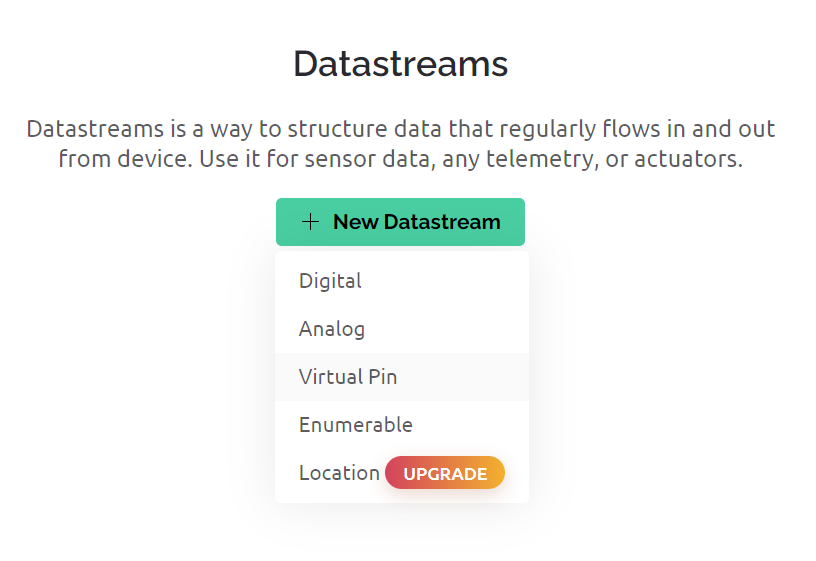

3. Enter the details to record your first datastream.
   
    

4. Click **Create** and return to the datastream interface.
   
    

5. Continue to add new Datastream according to the following table. Once done, click **Save and Apply**
   
    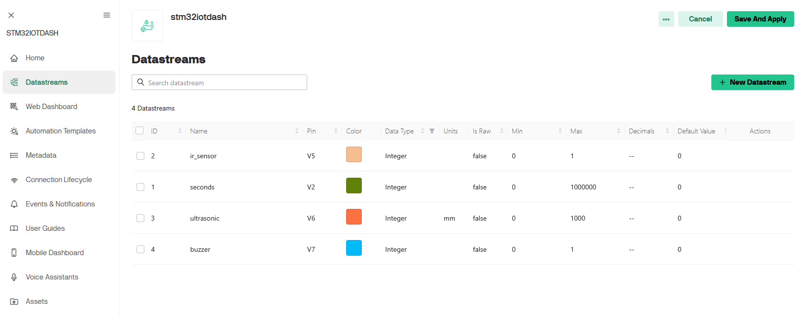
    
## 5.4. Add Dashboard

Dashboard is your main interface in monitoring all data received by Blynk Cloud.

1. Click on the **Dashboard** tab to open the dashboard interface. Then click the **Edit** button.

    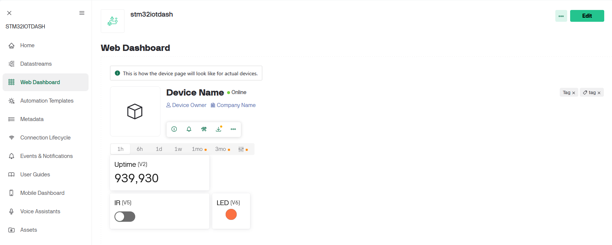

2. Add new widget by selecting any widget in the widget box (left panel). 
3. Click and drag a widget called  **Label** to the centre page. 
4. Hover over the widget and click the cogwheel for Label settings.
   
   
  
5. Insert the details to set label for the first datastream (V2). Click **Save**.
   
    
    
6. Click and drag a widget called **LED** to the centre page. Hover over the widget and click the cogwheel for LED settings.
   
   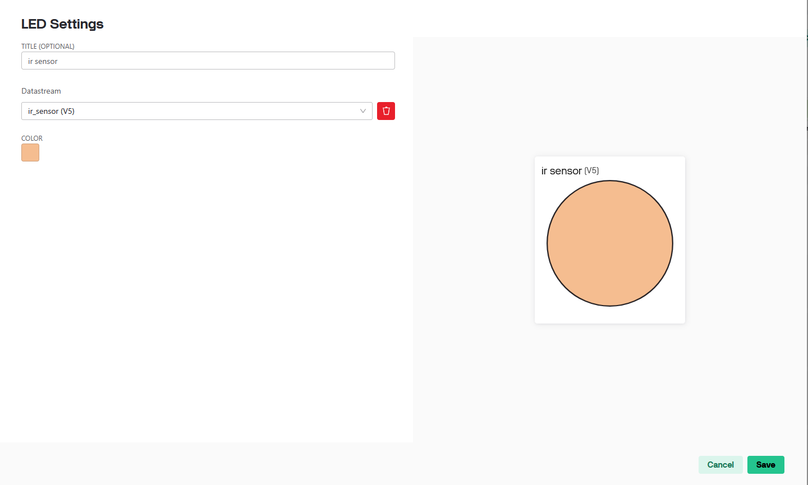
  
    > You can also change the color of the widget to your preference.

7.  Continue adding new widgets until all of the datastreams are presented in the dashboard. 

8.  Click **Save and Apply** at the top-right of the page.
   
## 5.5. Add New Device
Now, we need to create a new device for our template.

1. Click on the **Devices** tab in the left panel.
    
    

2. Click on **+ New Device** on the top right of the page.
3. Select **From template**.
   
   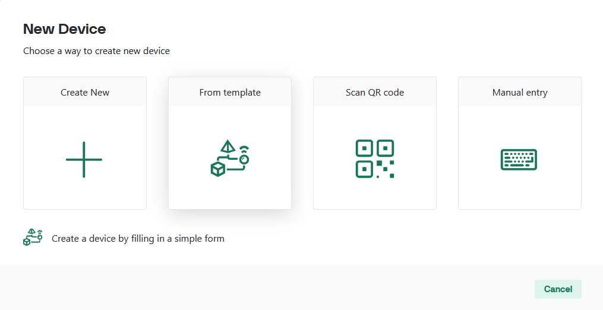

4. Fill in detail for the new device. Click **Create**.
   
    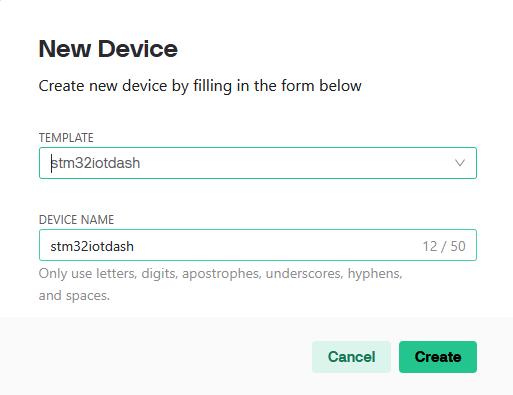

5. Your device page will appear.


## 5.6. Copy credentials
To link your Blynk Cloud device and your STM32 board, you need to copy the Device Info or credentials and paste the info to your Arduino sketch.

1. Click on your device, then click on the **Developers Tool** icon.
   
    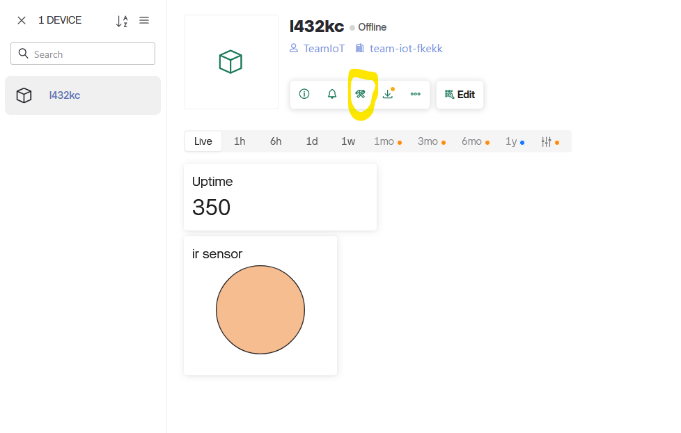

2. Click on the **Firmware Configuration** to copy your code to the clipboard. Then directly switch to your Arudino IDE with the stiot2022 skecth is open.

    

# 6. Running the project
1. Paste the credentials in Arduino IDE at the section.
   
   

2. Change your SSID and password according to your WiFi hotspot.
   

3. Select the board ```Nucleo-32```

    

4. Select the STM32 board ``Nucleo-L432KC``

    
    >Picture shows a different model.


5. Select the comm port
   
    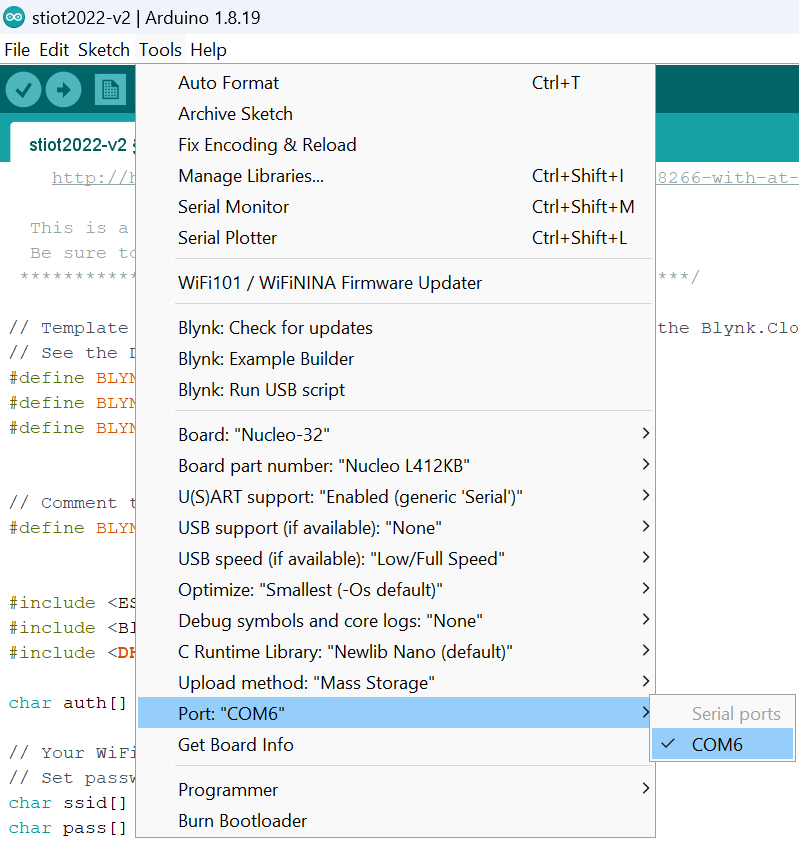
    >Picture shows a different model.

6. Click on the **Upload** button to program the board.
7. Once programmed, click the serial monitor (magnifier icon on the top-right) to view the serial comm.
8. Make sure ```Both NL & CR``` and ```115200 Baud``` are selected.
9. A Blynk image is appear indicating the program is running. Sample image:
    
    

10. If program not responding, press the RST button at the bottom of the STM32 board or re-program the board from Arduino IDE.


